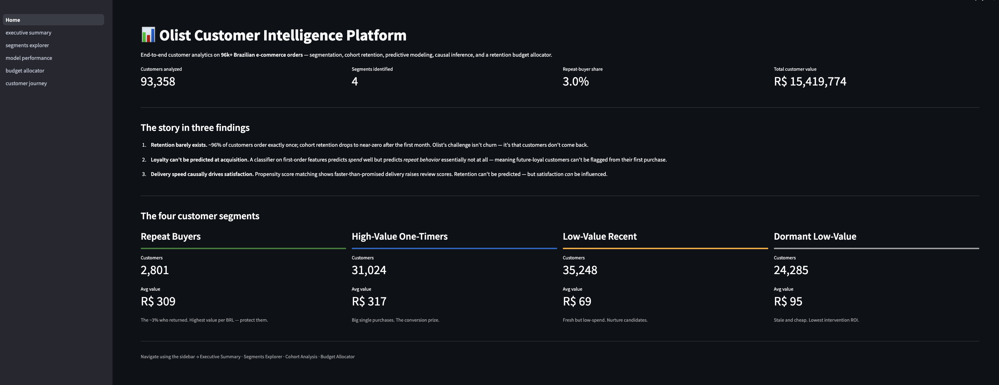
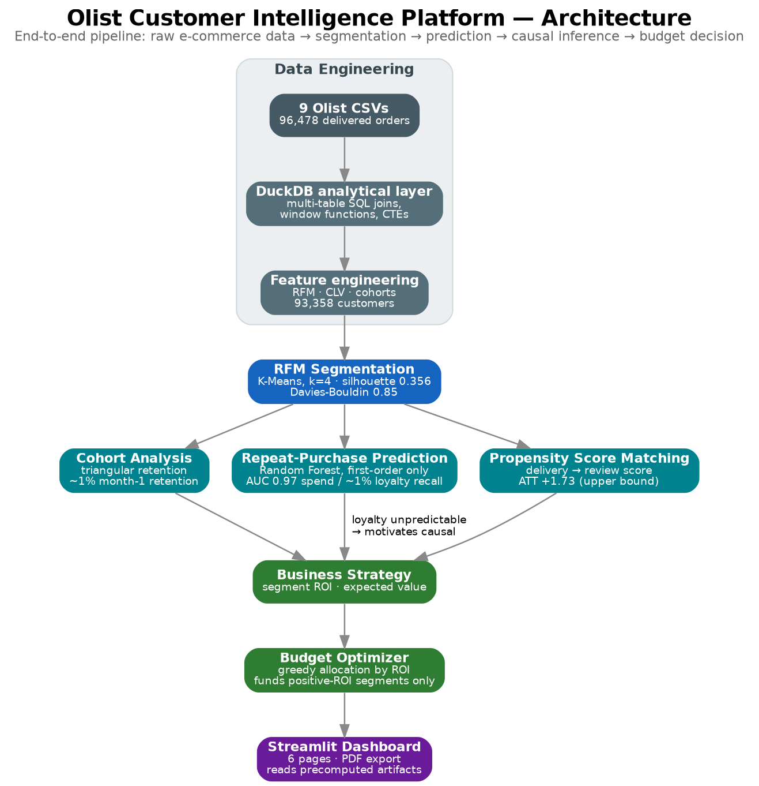
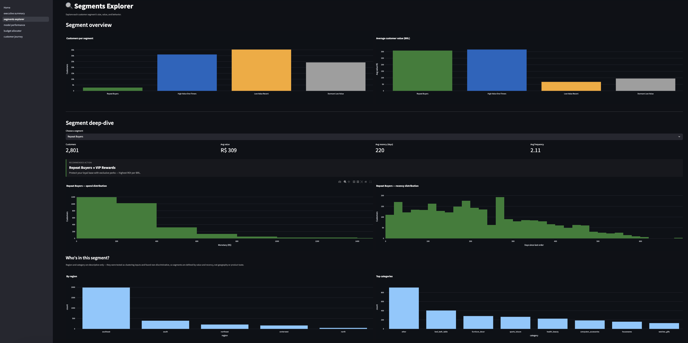
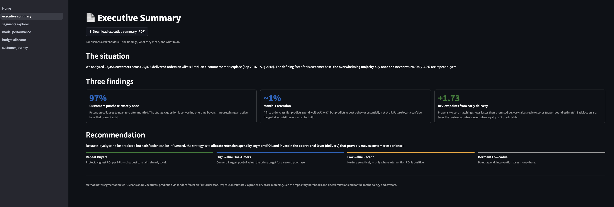
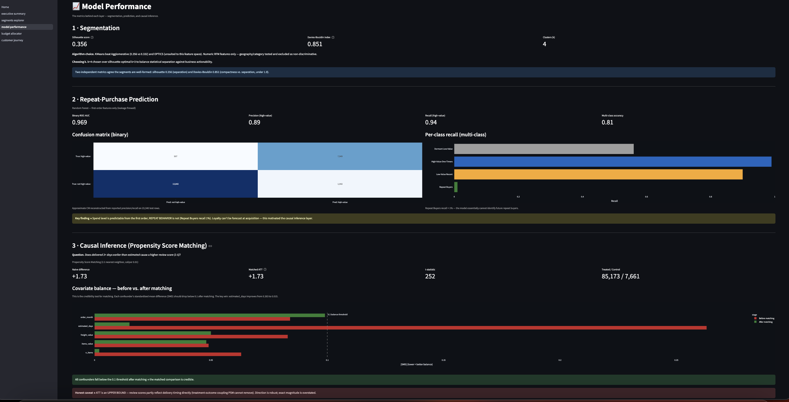
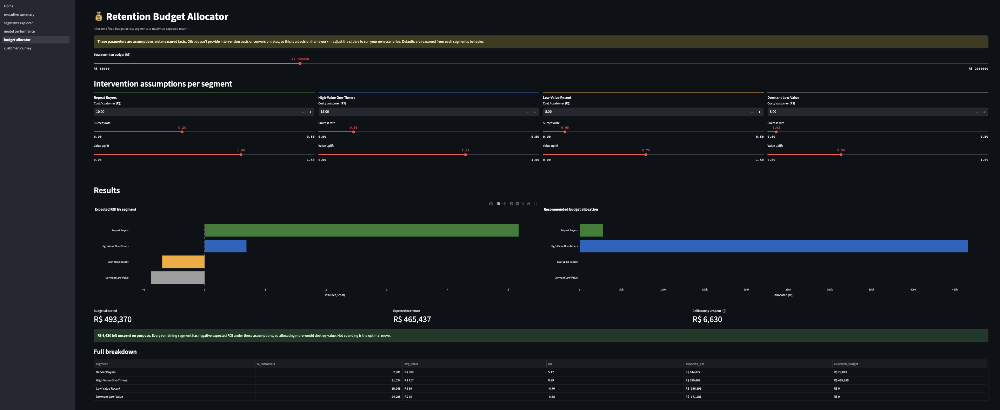
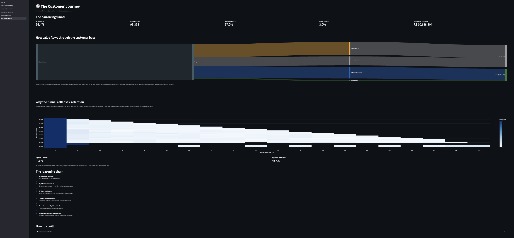

# Olist Customer Intelligence Platform

An end-to-end customer analytics system built on the [Brazilian E-Commerce Public Dataset by Olist](https://www.kaggle.com/datasets/olistbr/brazilian-ecommerce) (~96k orders across 9 relational tables). The project moves from raw multi-table data through segmentation, predictive modeling, and causal inference to a deployed decision tool — with an emphasis on **honest methodology** over inflated metrics.

**Live dashboard:** https://olist-customer-intelligence-dh5g93dk9z5sberappgzdoj.streamlit.app/

**Repository:** https://github.com/aniketgupta1704-cmd/olist-customer-intelligence



---

## What this project does

Given a marketplace where **97% of customers buy exactly once**, the platform answers four business questions:

1. **Who are the customers and what are they worth?** — RFM segmentation + cohort-based CLV
2. **Can we predict a customer's value from their first order?** — early-lifecycle classification
3. **What actually *causes* better customer experience?** — propensity score matching
4. **How should a fixed retention budget be allocated?** — segment-level ROI optimization

The connective thread is a genuine analytical arc: retention barely exists → future loyalty can't be predicted at acquisition → so the useful question becomes *causal* (what can the business influence?) → allocate budget accordingly.

---

## Architecture



Heavy computation (SQL joins, feature engineering, model training) runs offline in notebooks; the Streamlit app reads small precomputed artifacts (CSVs, JSON, pickled models). This is the standard production pattern — the serving layer stays lightweight and deploys cleanly. Full detail in [`docs/architecture.md`](docs/architecture.md).

---

## Key findings

| Finding | Evidence |
|---|---|
| **Retention is near-zero** | Cohort month-1 retention averages ~1% across every acquisition cohort. This is a one-time-buyer marketplace, not a churn problem. |
| **Loyalty is unpredictable at acquisition** | A first-order classifier predicts *spend* well (ROC-AUC 0.97) but predicts *repeat behavior* essentially not at all (Repeat Buyers recall ~1%). |
| **Delivery speed causally lifts satisfaction** | Propensity score matching: delivering 3+ days early raises review scores (ATT +1.73, reported as an upper bound). Balance achieved on all confounders after matching. |
| **Budget should concentrate, not spread** | ROI analysis funds only Repeat Buyers and High-Value One-Timers; low-value segments have negative intervention ROI and are deliberately excluded. |

---

## Customer segments

Four segments from K-Means (k=4) on RFM features (silhouette 0.356, Davies-Bouldin 0.85):

| Segment | Size | Avg value | Strategy |
|---|---|---|---|
| **Repeat Buyers** | 3.0% | R$ 309 | Protect — highest ROI per BRL |
| **High-Value One-Timers** | 33.2% | R$ 317 | Convert — largest value pool |
| **Low-Value Recent** | 37.8% | R$ 69 | Nurture selectively |
| **Dormant Low-Value** | 26.0% | R$ 95 | Do not target — negative ROI |



---

## The dashboard (6 pages)

**Executive Summary** — findings and recommendation for non-technical stakeholders, with PDF export



**Model Performance** — segmentation, prediction, and causal metrics with covariate-balance diagnostics



**Budget Allocator** — live ROI optimizer with adjustable intervention assumptions



**Customer Journey** — Sankey flow, retention cohort heatmap, and system architecture



Plus **Segments Explorer** (interactive profiles + 3-D cluster visualization) and **Home** (overview and headline metrics).

---

## Tech stack

**Data & modeling:** DuckDB (analytical SQL), pandas, scikit-learn (K-Means, Random Forest), scipy

**Causal inference:** propensity score matching (logistic propensity model, 1:1 nearest-neighbor, caliper matching, SMD balance diagnostics)

**App & viz:** Streamlit, Plotly, reportlab (PDF export)

**Methods:** RFM/CLV, cohort retention, clustering with model selection, leakage-controlled classification, causal inference, expected-value optimization

---

## Repository structure

```
olist-customer-intelligence/
├── README.md
├── requirements.txt
├── app/                  # Streamlit dashboard (Home + 6 pages + utils)
├── data/processed/       # precomputed artifacts the app reads
├── models/               # pickled clusterer, classifiers, preprocessor
├── notebooks/            # 01–05: EDA, RFM/CLV, clustering, prediction, causal
├── sql/                  # 01–05: the analytical SQL queries
├── src/                  # reusable modules (loaders, features, models, PDF)
└── docs/                 # architecture.md, limitations.md, diagrams, screenshots
```

---

## Running locally

```bash
git clone https://github.com/aniketgupta1704-cmd/olist-customer-intelligence.git
cd olist-customer-intelligence

python3.12 -m venv .venv
source .venv/bin/activate          # Windows: .venv\Scripts\activate
pip install -r requirements.txt

streamlit run app/Home.py
```

To regenerate the analytical artifacts from scratch, download the [Olist dataset](https://www.kaggle.com/datasets/olistbr/brazilian-ecommerce) into `data/raw/` and run notebooks `01`–`05` in order.

---

## Methodology & limitations

This project deliberately foregrounds its own caveats — see [`docs/limitations.md`](docs/limitations.md) for the full treatment, including the near-definitional nature of the spend classifier, the upper-bound framing of the causal estimate, and the assumption-driven budget allocator.

---

_Built as a portfolio project demonstrating end-to-end data science: data engineering, unsupervised and supervised learning, causal inference, business framing, and deployment._